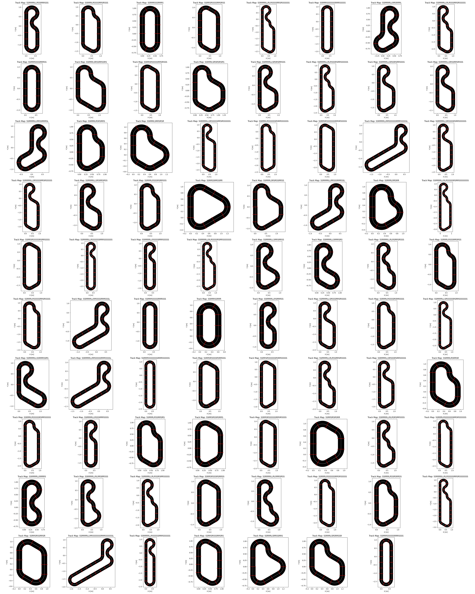

# CarreraTrackDesign

**CarreraTrackDesign** is a model that generates a subset of possible Carrera 1:32/1:24 slot car tracks based on user specified track sections. As the number of track segments increase, the permutations of possible track layouts explode and become computationally infeasible. For this reason, the result of the model should be viewed as a small subset of possible tracks, inspired by the user
provided starting point. The intention is for the user provided starting point to evolve iteratively as the model provides inspiration
and is re-run over and over.

Notes:
- The units of the axes in the figure is meter, meaning the figures accurately display the physical size of the different tracks. In realtion to this, note that the line, and consequently the dimensions of the track, represent the midpoint of the track. Hence, half the width of the track and potential additions should be kept in mind.
- The model does not yet include the possibility to have the track intersect.


# Usage

## Initialize model
```python
from carreratrackdesign.TrackGenerator import TrackGenerator

"""
Note: The initialization parameters can be omitted in practical use
      but are included here for completeness.
"""

# Tolerance for checking if a lap is completed
lap_tolerance = 0.05
orientation_tolerance = 0.01

# Physical dimensions (in meters) for Carrera 1:32 and 1:24 
turn_section_radius = 0.3
straight_section_length = 0.345

# Initialize the TrackGenerator class
track_gen = TrackGenerator(
    turn_section_radius = turn_section_radius,
    straight_section_length = straight_section_length,
    lap_tolerance = lap_tolerance,
    orientation_tolerance = orientation_tolerance,
    )
```
## Generate track layouts
```python

"""
Note: The model is not required to use all track sections, so -- unless
      user has a limited track in mind -- the number
      of track sections should be set to the maximum available to the user.
      
      The inputs maximum_number_of_tacks and max_time_per_split can be increased
      to generate additional and more different track suggestions.

      The input starting_sequence is a track section the generate track is required to
      begin with. The format is a string on the form

      starting_sequence = "SSRRRSSRRR"
      
      where each letter represent a track segment, the first letter represent the 'first track segment'
      and S, R, L represent straight, right and left track segments, respectively. The turn track
      segments are 60 degrees, so the above track is a closed 0-shape.
      If the user has no required track segment that should be included in the generated tracks, set

      starting_sequence = ""
      
      Upon studying the generated tracks, the user may decide on a particular section the 
      generated track should include. The user can specify this as starting_sequence and re-run
      the code.
"""
# The maximum number of tracks for a given split of turns into left/right (to control the computational load)
maximum_number_of_tacks = 20

# The maximum time (in seconds) spent on each split of turns into left/right (to further control the computational load)
max_time_per_split = 30

# User specified input of available track sections
number_of_turn_sections = 12
number_of_straight_sections = 16

# User specified sequence the track is required to begin with
starting_sequence = "RRRR"

# Generate the set of unique tracks
track_gen.generate_unique_tracks(
    number_of_turn_sections = number_of_turn_sections,
    number_of_straight_sections = number_of_straight_sections,
    starting_sequence =  starting_sequence,
    maximum_number_of_tacks = maximum_number_of_tacks,
    max_time_per_split = max_time_per_split
    )
```

## Generate track figures
```python
# Generate figures of the generated tracks
path = './test/figures/generated_tracks.png'

track_gen.generate_track_figures(path)
```

